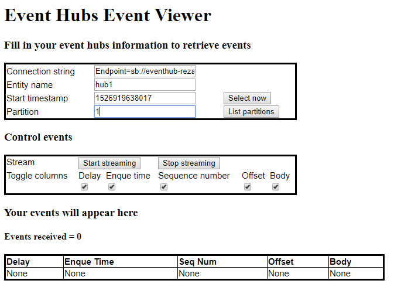

# EventHub Web Viewer
This open source project helps view/inspect your events sent to Azure EventHub/IoTHub.

A live version of this viewer is available [here](http://eventhub.shkreza.com).


## To build
1. Clone the code with `git clone https://github.com/shkreza/eventhub-viewer.git`
2. Install TypeScript (see instructions [here](https://code.visualstudio.com/docs/languages/typescript)).
3. Compile the typescript files in `lib/` folder (this produces `.js` files under `dist/`)
  ```
  tsc
  ```

## To run in localhost
1. Run:
  ```
  node dist/server.js
  ```
2. Open `http://localhost:4444` in your browser.

## To build as docker image
1. Compile typescript files:
  ```
  tsc
  ```
  This places compiled `.js` files under `dist/` folder.
  
2. Build docker image:
  ```
  docker build -t <YOUR_IMAGE_NAME> .
  ```
  A latest version of eventhub viewer is already pushed to `shkreza/eventhub-viewer` in [DockerHub](https://hub.docker.com/r/shkreza/eventhub-viewer/).

3. To run:
  ```
  docker run -p 4444:4444 <YOUR_IMAGE_NAME>
  ```

4. Open `http://<DOCKER_HOST>:4444` in your browser.

## To deploy in Kubernetes
Assuming you have already build and pushed the docker image:
1. Update `kubernetes/deployment.yaml` with `YOUR_IMAGE_NAME`:
  ```yaml
      spec:
        containers:
        - name: eventhub-viewer
          image: <YOUR_IMAGE_NAME>
  ```
2. Deploy Kubernetes container:
  ```
  kubectl create -f kubernetes/deployment.yaml
  ```
3. Deploy Kubernetes service (loadbalancer):
  ```
  kubectl create -f kubernetes/service.yaml
```
4. Check your services' external IP:
5. Deploy Kubernetes container
  ```
  kubectl get service eventhub-viewer
  ```
6. Open `http://<YOUR_SERVIE_EXTERNAL_IP>` in your browser (the service routes port `80` to your containers port `4444`).


